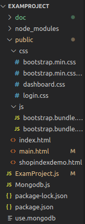
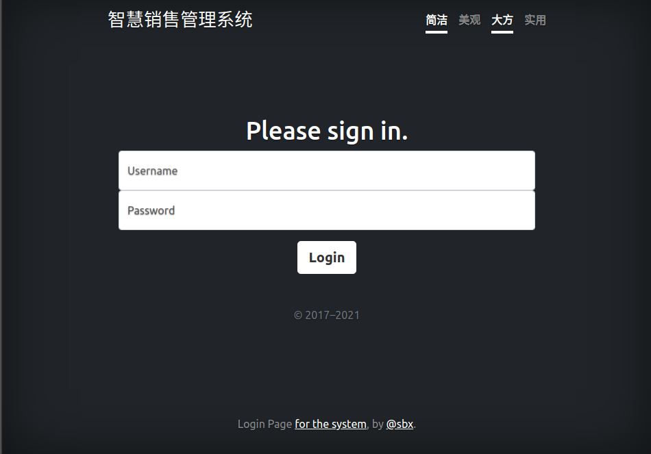
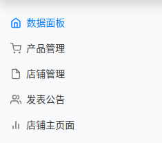
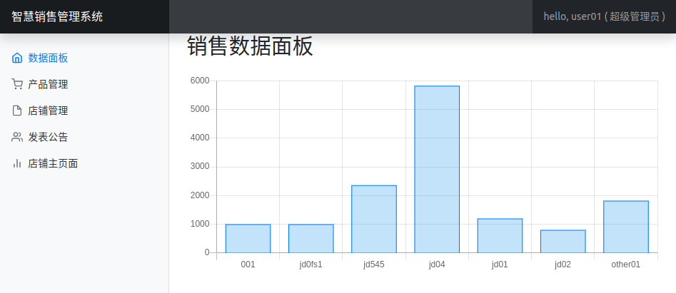
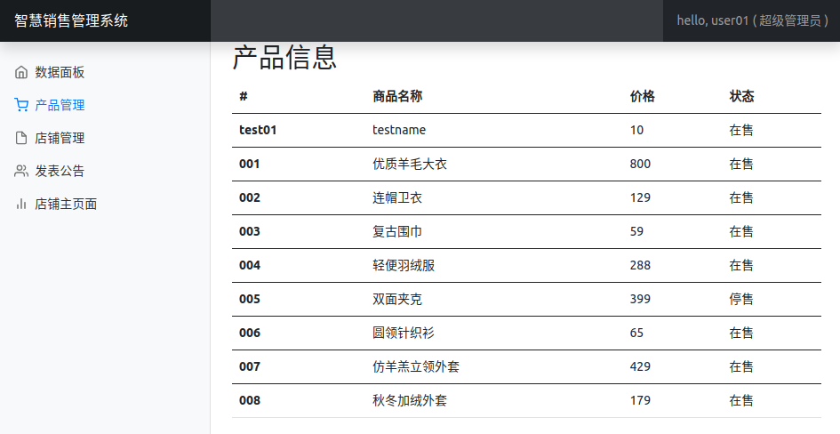
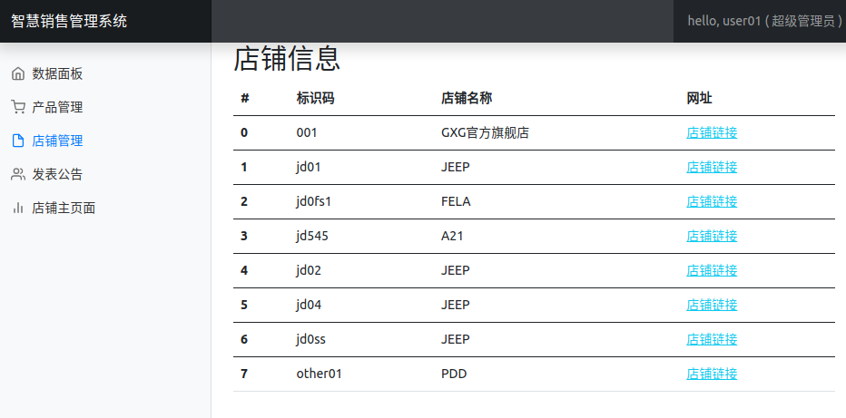
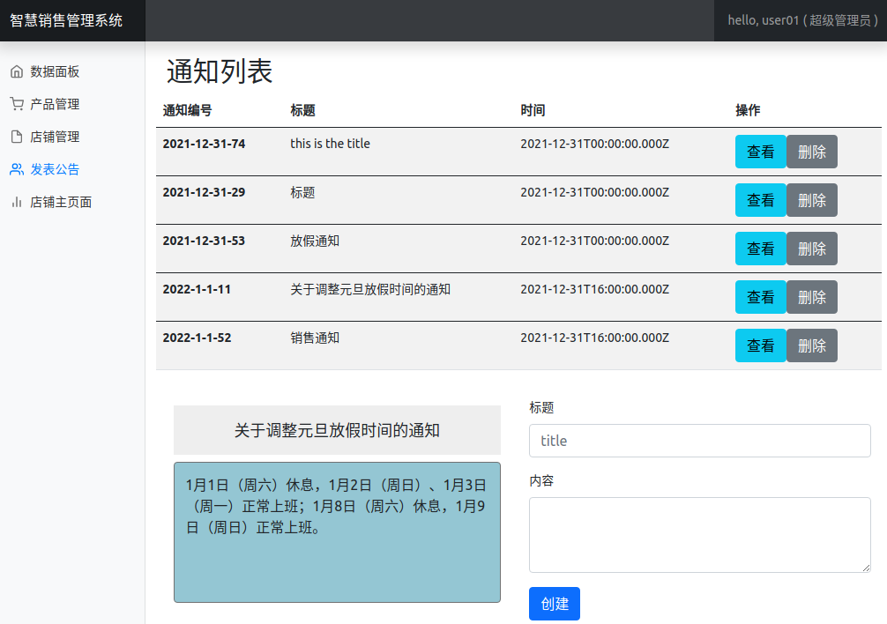

## 智慧销售管理系统

1. 项目设计部分：
   1）项目总体构成

   

   项目结构如上图所示：

   1. doc目录下存放说明文档
   2. node_modules目录下存放nodejs相关包
   3. public目录下存放静态文件（包含html、css、js文件）
   4. ExamProject.js是node项目主文件
   5. use.mongodb、Mongodb.js可以进行数据库数据操作（项目运行不需要）
   6. package-lock.json、package.json为node项目信息。
   
   2）使用到的相关技术
   
   1.	使用git进行项目源代码管理
   2.	使用express进行路由管理
   3.	使用ejs模板引擎进行页面渲染
   4.	使用ajax实现页面的局部刷新
   5.	使用mongo数据库，使用mongoose管理数据库
   6.	使用Bootstrap前端页面框架
   
2. 使用说明书：
   1）index页面（路由：'/index'）:

   
   
   点击登陆按钮，数据通过表单传给后台并进行数据验证，若数据正确则跳转到主页面，否则返回登陆页面。
   
   2）main页面（登陆验证成功后跳转）：
   
   
   
   包含以上5个功能模块：
   
   1. 数据面板：
   
      
   
      通过调用dashboard()方法生成，使用了Chart模块。
   
   2. 产品管理：
   
      
   
      展示了产品数据，使用ajax生成，数据同过访问‘/getGoodsData’(post)得到。
   
   3. 店铺管理：
   
      
   
      展示了店铺信息，使用ajax生成，数据同过访问‘/getShopsData’(post)得到。
   
   4.发布公告:
   
   
   
   ​		展示了通知列表，可以查看通知、删除通知、创建通知，使用ajax实现功能，对应处理路由均为‘/notice’(get、delete、put)。
   
   5. 店铺主页面
   
      跳转到一个静态页面，模拟管理系统到相关页面。

3. 开发日记（与commit对应）

   1）项目初始化 : ‘peoject init’(2021.12.28)、‘first commit’(2021.12.28)、‘666’(2021.12.28)、‘666’(2021.12.28)，以上提交进行了node项目的初始化以及git提交测试。

   2）技术方法使用测试：'using express test'(2021.12.28)、'build basic route'(2021.12.29)、'using mongoose test'(2021.12.29)，以上提交进行了express使用测试、基本路由建立、mongoose使用测试。

   3）功能实现：'handel login action'(2021.12.29)、'good function'(2021.12.30)、‘notice function’(2021.12.31)、'shop function and link jump'(2021.12.31)、'dashboard function'(2021.12.31)，以上提交完成了模块功能实现：用户登陆、产品管理、发布公告、店铺管理和页面跳转、 数据面板。

   4）综合调整：'adjustment'(2022.1.1)，进行了综合调整：厘清逻辑、编写说明、功能方法微调等。

   

